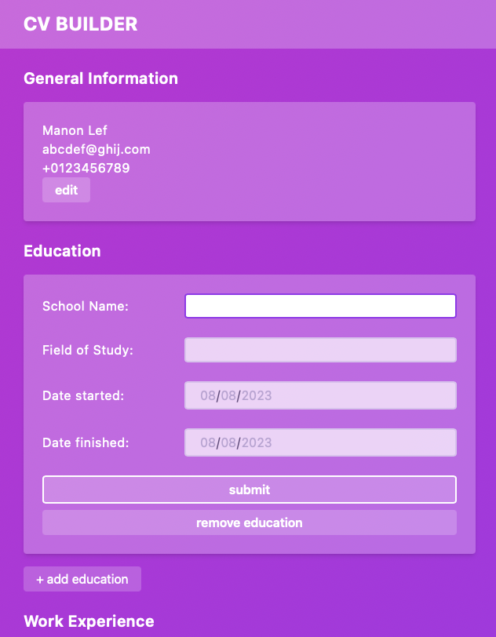

# CV Builder

## Result
[Try the CV Builder live here](https://cv-app-sepia.vercel.app)

## About this project
This project is the first project for practicing React. I decided to use this project to test Tailwind as well. What a joy!

## Project Objectives:
- Add a section for general information 
  - name
  - email
  - phone
- Add a section for education experience
  - school
  - title
  - date
- add a section for practical experience
  - company
  - position
  - responsibilities
  - dates
- edit and submit buttons with edit remembering values

## Objectives
- [x] A section to add general information like name, email and phone number.
- [x] A section to add your educational experience (school name, title of study and date of study)
- [x] A section to add practical experience (company name, position title, main responsibilities of your jobs, date from and until when you worked for that company)
- [x] Include an edit and submit button for each section or for the whole CV
- [x] Deploy with something other than GH Pages

## extra functionality implemented not in the objectives
- [x] I added Tailwind!

## Notes and Lessons Learned
**Props**
I had some linter warnings with props because I didn't cover type checking yet. I did some research and then installed `prop-types` to add `propTypes`, which fixed it.

**Tailwind**
Setting up TailWind and playing around with it was something I had on my list for a while. It went pretty smoothly and then I challenged myself to translate my former designs basics to this project. It's not what I had in mind for this particular project's look, but I figured it would add a layer of practice and a guideline of trying to implement a certain style. I also added a custom grid style to the tailwind config for my main layout. 

## Features or things I'd love to work on for this project in the future
- [ ] A more formal look 
- [ ] An updating CV on the right side of the page 
- [ ] Add form validation (left it out for now since this will most likely not add to my React skills or progress)
- [ ] Printable or downloadable CV
- [ ] Add storage